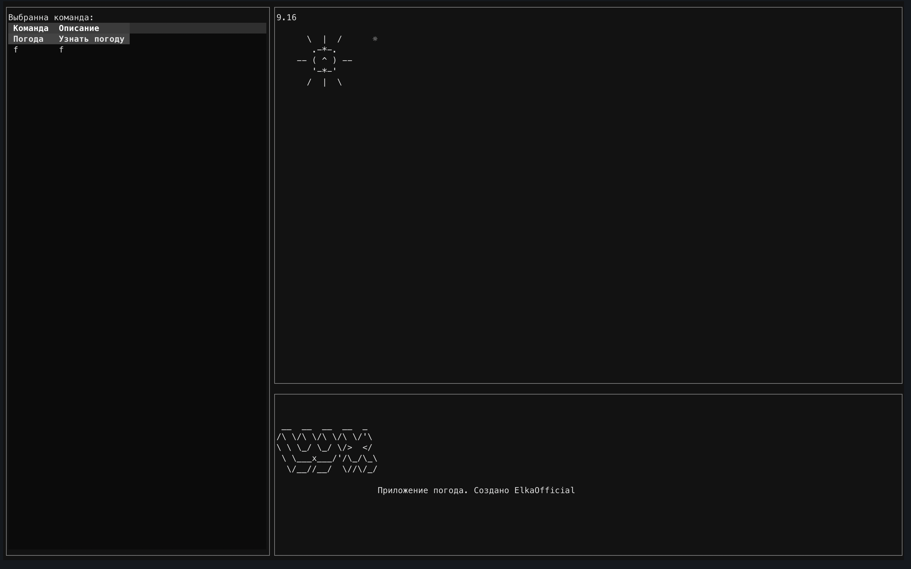

# wx — Weather Terminal App



**wx** is a modern terminal application written in Python for displaying current weather with an interactive interface and ASCII animations. Built on [Textual](https://github.com/Textualize/textual), it supports OpenWeather API, multilingual UI, and an extensible architecture.

---

## Table of Contents

- [Features](#features)
- [Screenshots](#screenshots)
- [Installation](#installation)
- [Quick Start](#quick-start)
- [Configuration](#configuration)
- [Architecture](#architecture)
- [Makefile](#makefile)
- [Contributing](#contributing)
- [License](#license)

---

## Features

- Fetch and display current weather for your city
- Colorful ASCII animations for various weather conditions: sun, clouds, rain, snow, day, night
- Interactive tables and buttons for navigation
- Multilingual interface (RU/EN)
- Flexible architecture for easy extension
- ASCII-art logo and UI styling

---

## Screenshots

| Main Screen | Weather Animation |
|-------------|------------------|
|  |  |

---

## Installation

### 1. Clone the repository

```sh
git clone https://github.com/yourusername/wx.git
cd wx
```

### 2. Install dependencies

```sh
pip install -r requirements.txt
```

### 3. Configuration

Set your OpenWeather API key and city in the configuration file.

---

## Quick Start

```sh
python main.py
```

---

## Configuration

The configuration file `config.yaml` contains the following parameters:

```yaml
api_key: "ваш_ключ_здесь"
city: "Ваш город"
units: "metric" # или "imperial"
lang: "ru" # или "en"
```

---

## Architecture

The application consists of the following components:

- `main.py` — entry point
- `weather.py` — weather data retrieval
- `ui.py` — Textual UI
- `animations.py` — ASCII animations
- `config.yaml` — configuration file

---

## Makefile

A `Makefile` is provided for convenience. Available commands:

```make
install    # Install dependencies
run        # Run the application
lint       # Check code style
test       # Run tests
```

---

## Contributing

1. Fork the repository
2. Create a branch for your changes: `git checkout -b feature/ваша_фича`
3. Commit your changes: `git commit -m 'Добавил новую фичу'`
4. Push the branch: `git push origin feature/ваша_фича`
5. Create a Pull Request

---

## License

MIT License. See the [LICENSE](LICENSE) file for details.